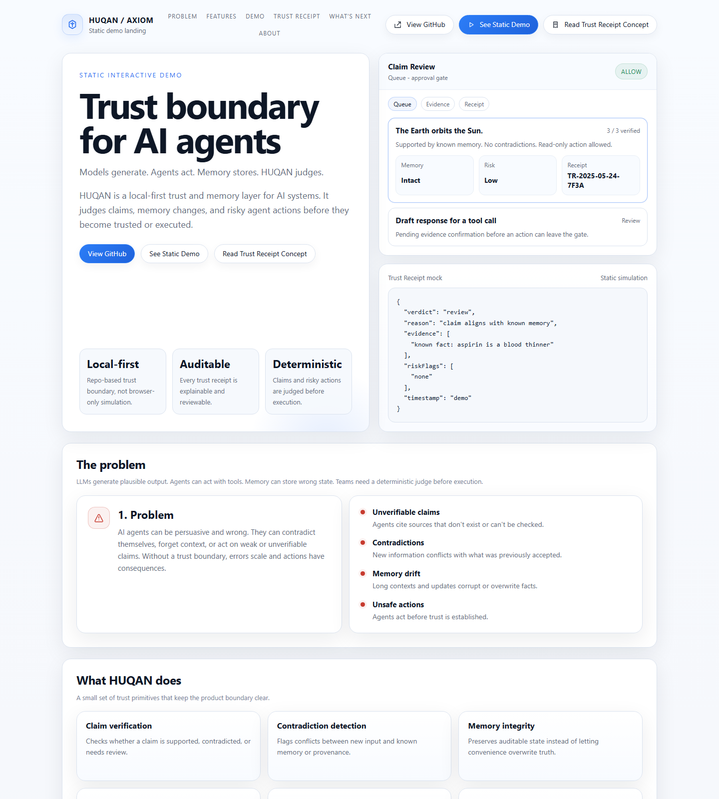
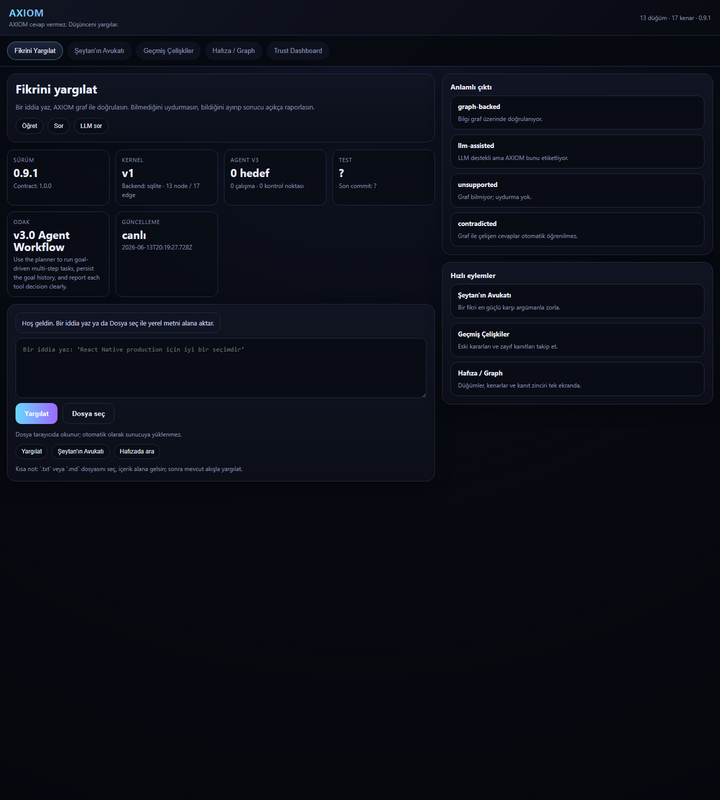

# Product Surfaces

AXIOM has three visible HTML surfaces in the repository. This note makes their roles explicit so contributors and external viewers do not treat them as competing products.

## Canonical surfaces

### 1. Public static demo

Canonical file: `demo/index.html`

Use this surface when:
- sharing a backend-free concept demo
- publishing to GitHub Pages, Vercel, or Cloudflare Pages
- showing product framing without exposing a live local engine

What it is:
- a static simulation
- safe to host without API keys
- safe to host without a running AXIOM server

What it is not:
- not live engine output
- not a connected verification console
- not a source of production Trust Receipts

### 2. Canonical local developer UI

Canonical file: `public/index.html`

Use this surface when:
- running `node server.js`
- testing the backend-connected UI locally
- exercising real verification, graph, and trust flows against the local engine

What it is:
- the local backend-connected interface
- the main interactive developer surface
- the UI that reflects the running AXIOM server

What it is not:
- not the public static marketing/demo landing
- not intended for static hosting without the local server

### 3. Docs entry surface

Canonical file: `docs/index.html`

Decision:
- keep it as a lightweight chooser page
- do not maintain it as a third competing product demo

Purpose:
- route visitors to the static demo
- route developers to install and usage docs
- make the surface split obvious without inventing another UI story

What it is not:
- not a fourth product mode
- not a second static demo
- not a backend-connected app

## Deploy guidance

- Static public demo: deploy `demo/index.html`
- Local product UI: serve `public/index.html` through `node server.js`
- Docs entry: optional repo/docs landing only

## Guardrails

- No backend, API keys, analytics, or telemetry are required for the static demo surface.
- The local UI should be treated as a developer/operator surface, not a public static landing.
- Product surface policy is now explicit; PTD-2 closes the ambiguity, not the UX roadmap.
